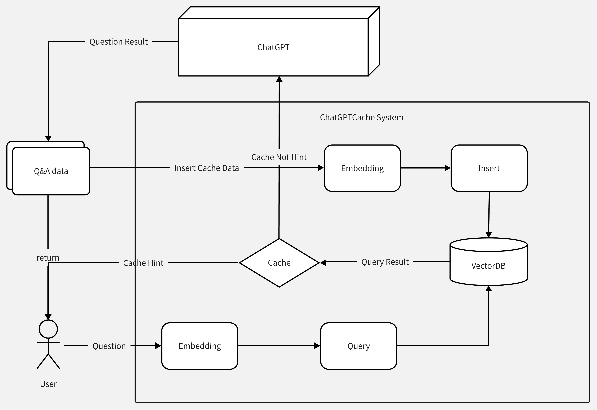

# ChatGPTCache

[English](README-CN.md) | 中文

ChatGPT缓存系统主要用于缓存用户在使用ChatGPT的问答数据。这个系统带来两个好处：

1. 快速响应用户请求：相比于大模型推理，缓存系统中查找数据将具有更低的延迟，从而更快地响应用户请求。
2. 降低服务成本：目前大多数ChatGPT服务都是基于请求次数进行收费，如果用户请求命中缓存，就可以减少请求次数，从而降低服务成本。

## 🧐 系统流程

系统的核心流程如上图所示：

1. 用户发送问题，该系统首先进行处理，将问题转换为向量形式进行查询，通过Embedding操作将问题向量化，作为Search操作的输入，在向量数据库中进行查询。
2. 如果查询结果存在，则将相关数据返回给用户。否则，进行下一步操作。
3. 用户请求转发至ChatGPT服务，得到返回数据，发送给用户。
4. 同时，对问答数据进行Embedding操作，将得到的向量插入到向量数据库中，以便用户下次查询时能够快速响应。

## 🤔 是否有必要使用缓存？

我认为有必要，理由如下：

- 基于ChatGPT开发的某些领域服务，许多问答具有一定的相似性。
- 对于一个用户，使用ChatGPT提出的一系列问题具有一定规律性，与其职业、生活习惯、性格等有一定关联。例如，程序员使用ChatGPT服务的可能性很大程度上与其工作有关。
- 如果您提供的ChatGPT服务面向大量用户群体，将其分为不同的类别，那么相同类别中的用户问的相关问题也有很大概率命中缓存，从而降低服务成本。

## 😵‍💫 系统难点

1. 如何对缓存数据进行Embedding操作
这部分涉及到两个问题：初始化数据来源以及数据转换过程的耗时问题。
- 对于不同场景的数据，其差异性很大。如果使用同一数据来源，缓存的命中率将大打折扣。可以采用两种方案：在使用缓存之前进行数据搜集，或者在系统初始阶段，只将数据插入到缓存系统进行Embedding训练。
- 数据转换的时间也是一个重要指标。如果缓存命中，其总体时间应该低于一次大模型推理的时间，否则系统将失去部分优势，影响用户体验。
2. 如何管理缓存数据
缓存数据管理的核心流程包括数据写入、搜索和清理。这要求接入的系统需要具备增量索引的能力，例如Milvus，也可以考虑使用轻量级的HNSW索引。数据清理可以保证缓存数据不会无限增长，同时也可以保证缓存查询的效率。
3. 如何评估缓存结果
从缓存中获取相应的结果列表后，需要使用模型对结果进行问答相似度匹配。如果相似度达到一定阈值，则直接将该回答返回给用户。否则，将请求转发至ChatGPT。