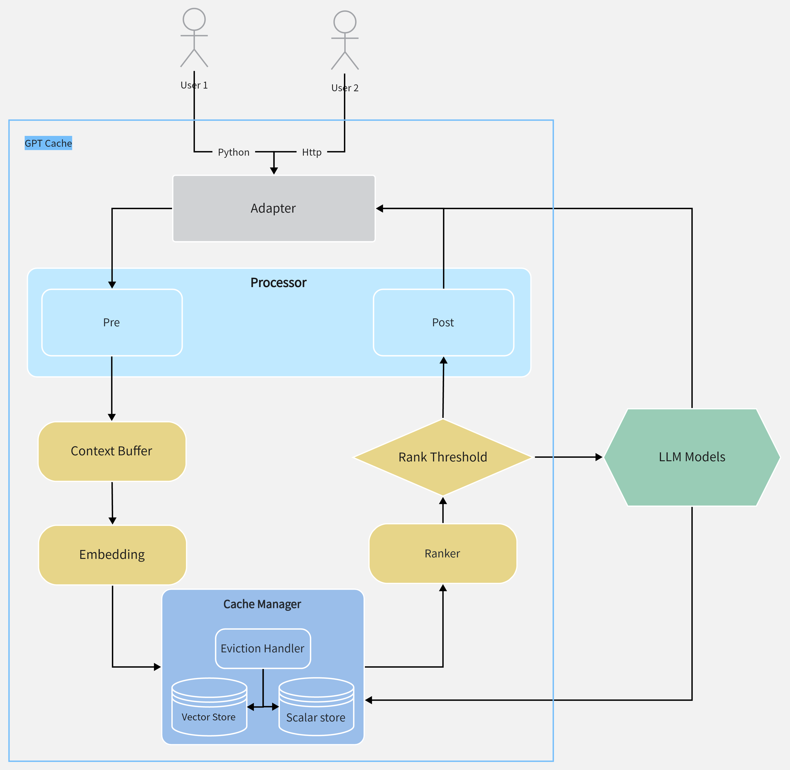

# GPT Cache

## 🤠 What is GPT Cache?

Large Language Models (LLMs) are a promising and transformative technology that has rapidly advanced in recent years. These models are capable of generating natural language text and have numerous applications, including chatbots, language translation, and creative writing. However, as the size of these models increases, so do the costs and performance requirements needed to utilize them effectively. This has led to significant challenges in developing on top of large models such as ChatGPT.

To address this issue, we have developed GPT Cache, a project that focuses on caching responses from language models, also known as a semantic cache. The system offers two major benefits:

1. Quick response to user requests: the caching system provides faster response times compared to large model inference, resulting in lower latency and faster response to user requests.
2. Reduced service costs: most LLM services are currently charged based on the number of tokens. If user requests hit the cache, it can reduce the number of requests and lower service costs.

If you find this idea helpful, please consider giving me a star 🌟, as it helps me as well.

## 🤔 Why would GPT Cache be helpful?

A good analogy for GptCache is to think of it as a more semantic version of Redis. In GptCache, hits are not limited to exact matches, but rather also include prompts and context similar to previous queries. We believe that the traditional cache design still works for AIGC applications for the following reasons:

- Locality is present everywhere. Like traditional application systems, AIGC applications also face similar hot topics. For instance, ChatGPT itself may be a popular topic among programmers.
- For purpose-built SaaS services, users tend to ask questions within a specific domain, with both temporal and spatial locality.
- By utilizing vector similarity search, it is possible to find a similarity relationship between questions and answers at a relatively low cost.

We provide [benchmarks](https://github.com/zilliztech/gpt-cache/blob/main/example/benchmark/benchmark_sqlite_faiss_towhee.py) to illustrate the concept. In semantic caching, there are three key measurement dimensions: false positives, false negatives, and hit latency. With the plugin-style implementation, users can easily tradeoff these three measurements according to their needs.

## 😊 Quick Start

**Note**:
- You can quickly try GPT cache and put it into a production environment without heavy development. However, please note that the repository is still under heavy development.
- By default, only a limited number of libraries are installed to support the basic cache functionalities. When you need to use additional features, the related libraries will be **automatically installed**.
- If you encounter issues installing a library due to a low pip version, run: `python -m pip install --upgrade pip`.

### pip install

```bash
pip install gpt_cache
```

### dev install

```bash
# clone gpt cache repo
git clone https://github.com/zilliztech/gpt-cache
cd gpt-cache

# install the repo
pip install -r requirements.txt
python setup.py install
```

### example usage

If you just want to achieve precise matching cache of requests, that is, two identical requests, you **ONLY** need **TWO** steps to access this cache

1. Cache init

```python
from gpt_cache.core import cache

cache.init()
# If you use the `openai.api_key = xxx` to set the api key, you need use `cache.set_openai_key()` to replace it.
# it will read the `OPENAI_API_KEY` environment variable and set it to ensure the security of the key.
cache.set_openai_key()
```
2. Replace the original openai package

```python
from gpt_cache.view import openai

# openai requests DON'T need ANY changes
answer = openai.ChatCompletion.create(
    model="gpt-3.5-turbo",
    messages=[
        {"role": "system", "content": "You are a helpful assistant."},
        {"role": "user", "content": "foo"}
    ],
)
```

If you want to experience vector similarity search cache locally, you can use the example [Sqlite + Faiss + Towhee](example/sqlite_faiss_towhee/sqlite_faiss_towhee.py).

More Docs：
- [System Design, how it was constructed](doc/system.md)
- [Features, all features currently supported by the cache](doc/feature.md)
- [Examples, learn better custom caching](example/example.md)


## 🤗 Modules Overview



- Pre-processing, extract the key information from the request:
    - Obtain the last message from the request using `pre_embedding.py#last_content`
    - Obtain the session context (TODO)
- Embed the text into a vector for similarity search:
    - [x]  Use [towhee](https://towhee.io/) with the paraphrase-albert-small-v2 model for English and uer/albert-base-chinese-cluecorpussmall for Chinese.
    - [x]  Use the OpenAI embedding API.
    - [x]  Keep the text as a string without any changes.
    - [ ]  Use the [cohere](https://docs.cohere.ai/reference/embed) embedding API.
    - [ ]  Support [Hugging Face](https://huggingface.co/) embedding API.
- Cache data manager, which includes searching, saving, or evicting data. Additional storage support will be added in the future, and contributions are welcome:
    - Scalar store:
        - [x]  Use [SQLite](https://sqlite.org/docs.html).
        - [ ]  Use [PostgreSQL](https://www.postgresql.org/).
        - [ ]  Use [MySQL](https://www.mysql.com/).
    - Vector store:
        - [x]  Use [Milvus](https://milvus.io/).
        - [x]  Use [Zilliz Cloud](https://cloud.zilliz.com/).
        - [ ]  Use other vector databases
    - Vector index:
        - [x]  Use [FAISS](https://faiss.ai/).
- Evaluate similarity by judging the quality of cached answers:
    - Use the search distance, as described in `simple.py#pair_evaluation`.
    - [towhee](https://towhee.io/) uses the albert_duplicate model for precise comparison of problems to problems mode. It supports only 512 tokens.
    - For string comparison, judge the cache request and the original request based on the exact match of characters.
    - For numpy arrays, use `linalg.norm`.
- Post-processing: determine how to return multiple cached answers to the user:
    - Choose the most similar answer.
    - Choose randomly.
    - Other ranking policies


## 😆 Contributing

Would you like to contribute to the development of GPT Cache? Take a look at [our contribution guidelines](doc/contributing.md).


## 🙏 Thank

Thanks to my colleagues in the company [Zilliz](https://zilliz.com/) for their inspiration and technical support.
