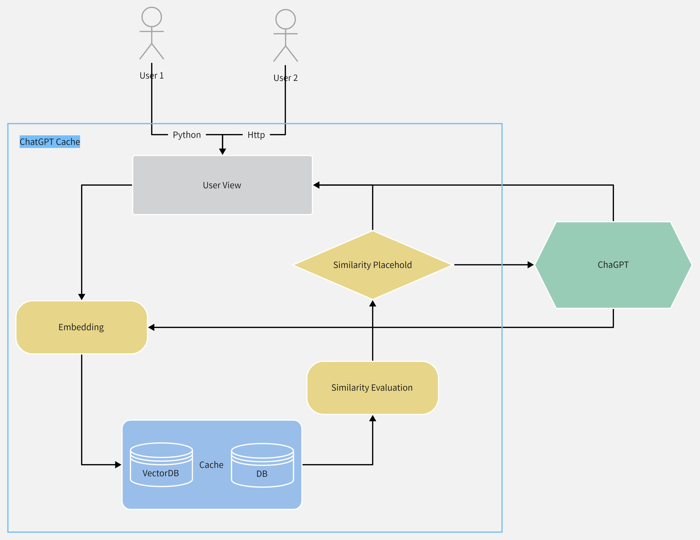

# GPT Cache

English | [中文](README-CN.md)

The GPT Cache system is mainly used to cache the question-answer data of users in ChatGPT. This system brings two benefits:

1. Quick response to user requests: compared to large model inference, searching for data in the caching system will have lower latency, enabling faster response to user requests.
2. Reduced service costs: currently, most ChatGPT services are charged based on the number of requests. If user requests hit the cache, it can reduce the number of requests and thus lower service costs.

If the idea 💡 is helpful to you, please feel free to give me a star 🌟, which is helpful to me.

## 🤔 Is Cache necessary?

I believe it is necessary for the following reasons:

- Many question-answer pairs in certain domain services based on ChatGPT have a certain similarity.
- For a user, there is a certain regularity in the series of questions raised using ChatGPT, which is related to their occupation, lifestyle, personality, etc. For example, the likelihood of a programmer using ChatGPT services is largely related to their work.
- If your ChatGPT service targets a large user group, categorizing them can increase the probability of relevant questions being cached, thus reducing service costs.

## 😊 Quick Access

### alpha test package install

**Note**: You can quickly experience the cache, it is worth noting that maybe this is not very stable.

```bash
pip install -i https://test.pypi.org/simple/ gpt-cache==0.0.1
```

1. Cache init

```python
from gpt_cache.core import cache

cache.init()
# it will read the `OPENAI_API_KEY` environment variable
cache.set_openai_key()
```
2. Replace the original openai package

```python
from gpt_cache.view import openai

# openai requests don't need any changes
answer = openai.ChatCompletion.create(
    model="gpt-3.5-turbo",
    messages=[
        {"role": "system", "content": "You are a helpful assistant."},
        {"role": "user", "content": "foo"}
    ],
)
```
3. End of request, persistent cache
```python
cache.data_manager.close()
```

Run locally, if you want better results, you can use the example [Sqlite + Faiss + Towhee](example/sf_towhee/sf_manager.py). Among them, Sqlite + Faiss is used for cache data management, and Towhee(**Only supports English**, Chinese needs to change the model) is used for embedding operations.

In actual production, or in a certain user group, it is necessary to consider the vector search part more, you can get to know [Milvus](https://github.com/milvus-io/milvus)，or [Milvus Cloud](https://cloud.zilliz.com/), which allows you to quickly experience Milvus vector retrieval.

More examples：[example](example/example.md)

## 🧐 System flow


The core process of the system is shown in the diagram above:

1. The user sends a question to the system, which first processes the question by converting it to a vector and querying it in the vector database using the Embedding operation.
2. If the query result exists, the relevant data is returned to the user. Otherwise, the system proceeds to the next step.
3. The user request is forwarded to the ChatGPT service, which returns the data and sends it to the user.
4. At the same time, the question-answer data is processed using the Embedding operation, and the resulting vector is inserted into the vector database for fast response to future user queries.

## 😵‍💫 System Core

1. How to perform **embedding** operations on cached data
This part involves two issues: the source of initialization data and the time-consuming data conversion process.
- For different scenarios, the data can be vastly different. If the same data source is used, the hit rate of the cache will be greatly reduced. There are two possible solutions: collecting data before using the cache, or inserting data into the cache system for embedding training during the system's initialization phase.
- The time required for data conversion is also an important indicator. If the cache is hit, the overall time should be lower than the inference time of a large-scale model. Otherwise, the system will lose some advantages and reduce user experience.
2. How to **manage** cached data
The core process of managing cached data includes data writing, searching, and cleaning. This requires the system being integrated to have the ability of incremental indexing, such as Milvus, and lightweight HNSW index can also meet the requirements. Data cleaning can ensure that the cached data will not increase indefinitely, while also ensuring the efficiency of cache queries.
3. How to **evaluate** cached results
After obtaining the corresponding result list from the cache, the model needs to perform question-and-answer similarity matching on the results. If the similarity reaches a certain threshold, the answer will be returned directly to the user. Otherwise, the request will be forwarded to ChatGPT.

## 🤩 System Structure



1. User layer, wrapping openai interface, including: using openai python and http service, reference: [api-chat](https://platform.openai.com/docs/api-reference/chat) [guide-chat](https://platform.openai.com/docs/guides/chat/introduction),
To enable users to access the cache, python only needs to modify the package name, and for api, it only needs to be simply encapsulated into an http service through the library
2. Embedding layer
Extract the features in the message, that is, convert the text into a vector
3. Cache layer
Manage cached data, including:
- save scalar, vector data;
- vector data search;
- get scalar data based on search results;
More: set cache data limit, update cache data
4. Similarity assessment
Evaluate the search results and give the corresponding credibility

## 🙏 Thank

Thanks to my colleagues in the company [Zilliz](https://zilliz.com/) for their inspiration and technical support.